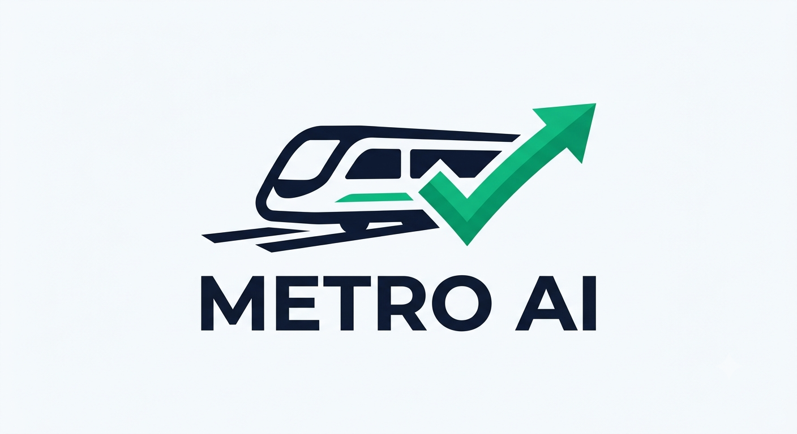

# Branding, Visual Psychology & Design Identity 🎨
## Project: METRO AI

  

Building an international remittance aggregator requires establishing absolute **institutional trust**. Users are navigating complex, high-stakes cross-border transfers; therefore, the visual identity must feel secure, analytical, and highly professional. METRO AI intentionally rejects volatile "crypto-style" aesthetics in favor of clean, tier-one fintech design principles.

---

## 1. Core Color Palette & Psychology

The application uses a tri-color architectural scheme designed to balance security with performance optimization:

| Identity | Element | Hex Code | Psychological Triggers |
| :--- | :--- | :--- | :--- |
| **Primary** | Deep Navy Blue | `#0F172A` | Trust, systemic security, banking-grade stability. |
| **Secondary**| Emerald/Teal | `#10B981` | Wealth generation, positive growth, successful rate optimization. |
| **Neutral** | Slate / Off-White | `#F8FAFC` | High scannability, clarity, clean data display. |

---

## 2. Typography & Readability

Because METRO AI displays highly dense financial tables, currency graphs, and AI text summaries, readability is a core system requirement.

* **Primary Font Stack:** `Inter`, `system-ui`, `sans-serif`
* **Design Philosophy:** `Inter` ensures that numbers, exchange rates, and small percentages remain perfectly legible on mobile screens.

---

## 3. Logo Philosophy & High-Speed Geometry

The visual identity centers on a minimalist, high-speed metro train firing from left to right across the screen:
1. **The Kinetic Horizon:** Moving from left to right represents structural progress and the forward path of capital migration (CAD ➡️ INR).
2. **The Velocity Convergence:** The sharp, aerodynamic body of the train signifies the hyper-speed processing of the FastAPI backend framework.
3. **The Arrival Signal:** The front tip of the vehicle morphs seamlessly into an energetic Emerald Green checkmark gesture. This serves as an immediate subconscious trigger for the user, communicating that their transaction has successfully reached its destination without hidden friction or delays.
